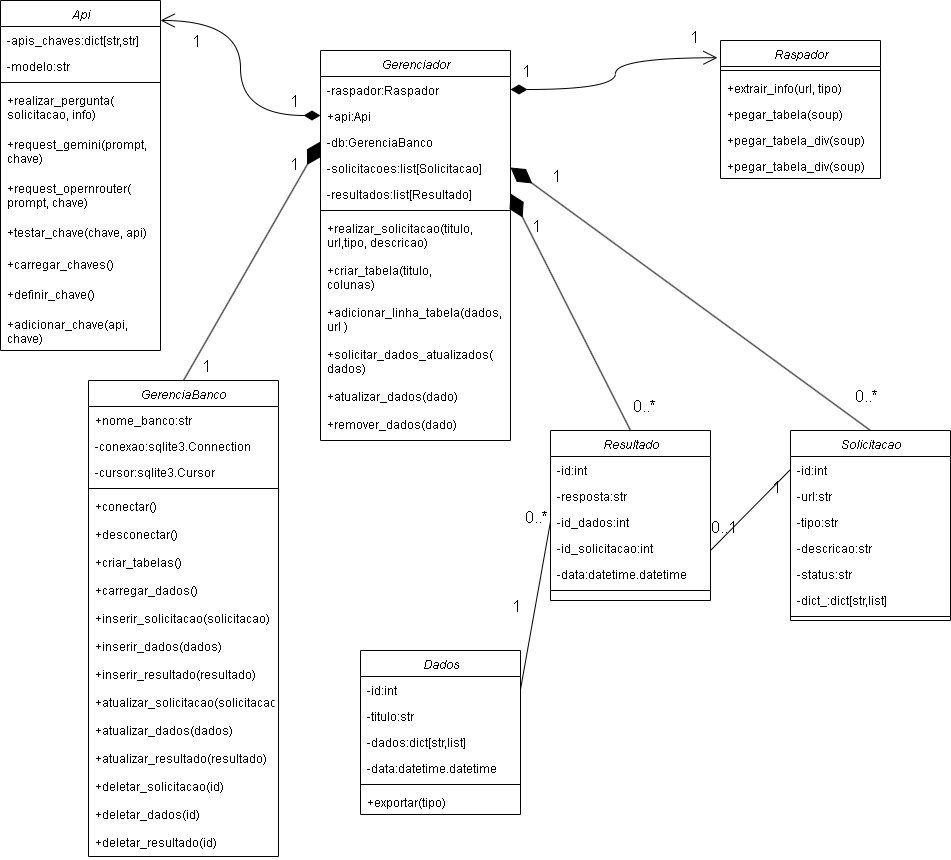
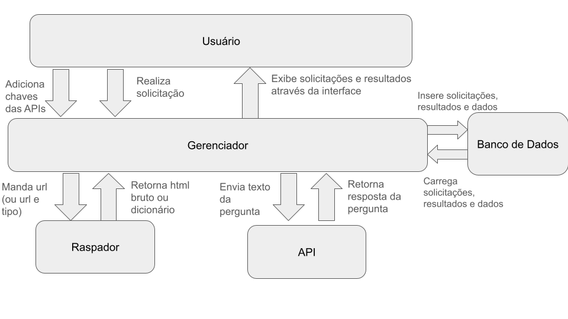

# 🔍 Sistema de Localização de Informações em Páginas Web

Projeto final da disciplina de Programação Orientada a Objetos II — UFSC  
Aluno: **João Pedro Darabas Cardoso**  
Professor: **Alex Sandro Roschildt Pinto**

---

## 🎯 Objetivo

Desenvolver um sistema que permita ao usuário solicitar informações específicas de páginas web. Utilizando **técnicas de Web Scraping** combinadas com **modelos de linguagem via API**, o sistema coleta, armazena e organiza dados que podem ser visualizados ou atualizados posteriormente.

---

## 🧩 Como Funciona

1. **Cadastro de APIs**  
   O usuário deve cadastrar ao menos uma chave de API (como `openrouter.ai` ou `Google Gemini`) para utilizar os recursos do sistema.

2. **Criação de Solicitação**  
   O usuário pode:
   - Informar uma URL, tipo de informação (tabela, card, etc.), título e descrição.
   - Ou criar uma tabela em branco para preenchimento posterior.

3. **Raspagem e Processamento**
   - O raspador coleta os dados da página (HTML ou estrutura extraída).
   - Caso necessário, a LLM complementa ou corrige a informação usando linguagem natural.

4. **Armazenamento e Visualização**
   - Informações são salvas no banco de dados.
   - Resultados são exibidos via interface gráfica.
   - Tabelas podem ser manipuladas (adicionar/atualizar linhas) e exportadas em vários formatos (CSV, JSON, Excel, PDF).

---
## Diagrama UML

---
## 🧠 Arquitetura do Sistema

---

## ⚙️ Tecnologias Utilizadas

| Ferramenta         | Uso Principal                                   |
|--------------------|-------------------------------------------------|
| **PyQt6**          | Interface gráfica                               |
| **OpenRouter**, **Gemini** | APIs para interação com LLMs               |
| **Selenium**       | Web scraping de páginas com conteúdo dinâmico   |
| **BeautifulSoup**  | Web scraping de conteúdo estático               |
| **requests**       | Requisições HTTP                                |
| **JSON**           | Armazenamento temporário e exportações          |
| **SQLite**         | Banco de dados local                            |
| **PyFPDF**         | Exportação de dados em PDF                      |
| **pandas**         | Manipulação e exportação de dados               |

---

## 📂 Exportação de Dados

Após coleta e processamento, os dados podem ser exportados para:

- `.csv`
- `.json`
- `.xlsx`
- `.pdf`

---

## 🚧 Status de Erros

- Se ocorrer um erro durante a raspagem ou na LLM, o sistema salva a solicitação com **status de erro** e notifica o usuário.

---